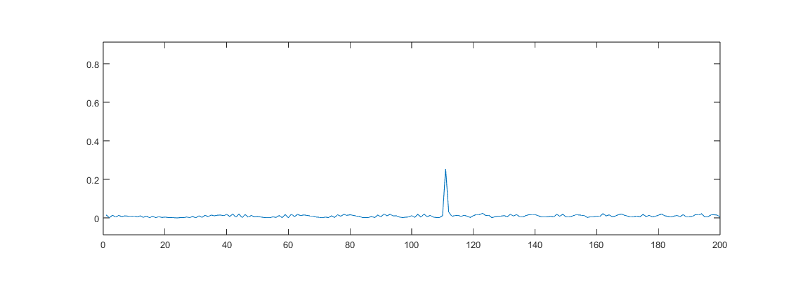
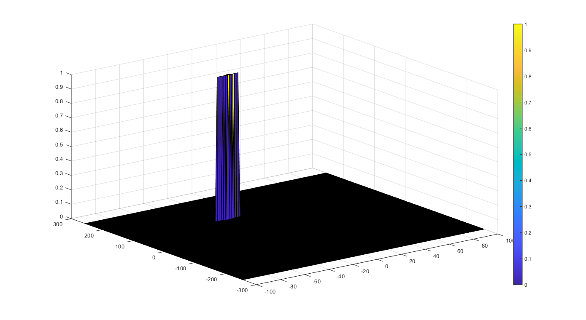

# Udacity_SFND_Radar_Target_Generation_and_Detectionet
## Project Layout


* Configure the FMCW waveform based on the system requirements.
* Define the range and velocity of target and simulate its displacement.
* For the same simulation loop process the transmit and receive signal to determine the beat signal
* Perform Range FFT on the received signal to determine the Range
* Towards the end, perform the CFAR processing on the output of 2nd FFT to display the target.

## Rubric
### FMCW Waveform Design
> Using the given system requirements, design
a FMCW waveform. Find its Bandwidth (B), chirp time (Tchirp) and slope of the chirp.
```
rangeResolution = 1;
Rmax = 200;

c = 3e8;
B = c / (2 * rangeResolution);
Tchirp = 5.5 * 2 * Rmax / c;
slope = B / Tchirp;
```
slope = 2.0455e+13

### Simulation Loop
> Simulate Target movement and calculate the beat or mixed signal for every timestamp.

```
%% Signal generation and Moving Target simulation
% Running the radar scenario over the time. 

for i=1:length(t)        
    
    % *%TODO* :
    %For each time stamp update the Range of the Target for constant velocity. 
    r_t(i) = targetRange + targetVelocity * t(i);
    
    % *%TODO* :
    %For each time sample we need update the transmitted and
    %received signal. 
    Tx(i) = cos(2 * pi * (fc * t(i) + slope * t(i)^2 / 2));
    
    %time delay
    td(i) = 2 * r_t(i) / c;
    Rx(i) = cos(2 * pi * (fc * (t(i) - td(i)) + (slope * (t(i) - td(i))^2) / 2));

    % *%TODO* :
    %Now by mixing the Transmit and Receive generate the beat signal
    %This is done by element wise matrix multiplication of Transmit and
    %Receiver Signal
    Mix(i) = Tx(i).*Rx(i);
    
end
```

### Range FFT (1st FFT)
> Implement the Range FFT on the Beat or Mixed Signal and plot the result.
```
%% RANGE MEASUREMENT

 % *%TODO* :
%reshape the vector into Nr*Nd array. Nr and Nd here would also define the size of
%Range and Doppler FFT respectively.
signal = reshape(Mix, [Nr, Nd]);

 % *%TODO* :
%run the FFT on the beat signal along the range bins dimension (Nr) and
%normalize.
signal_fft = fft(signal, Nr);
signal_fft = signal_fft./Nr;

 % *%TODO* :
% Take the absolute value of FFT output
signal_fft = abs(signal_fft);

 % *%TODO* :
% Output of FFT is double sided signal, but we are interested in only one side of the spectrum.
% Hence we throw out half of the samples.
signal_fft  = signal_fft(1:Nr/2+1);    

%plotting the range
figure ('Name','Range from First FFT')
subplot(2,1,1)

% *%TODO* :
% plot FFT output 
plot(signal_fft); 
axis ([0 200 0 1]);
```



### 2D CFAR
> Implement the 2D CFAR process on the output of 2D FFT operation, i.e the Range Doppler Map.



<b>Steps:</b>  
1. Determine the number of Training cells,Guard cells for each dimension and offset value.
```
% *%TODO* :
%Select the number of Training Cells in both the dimensions.
Tr = 10;
Td = 8;

% *%TODO* :
%Select the number of Guard Cells in both dimensions around the Cell under 
%test (CUT) for accurate estimation
Gr = 4;
Gd = 4;

% *%TODO* :
% offset the threshold by SNR value in dB
offset = 6;
```
2. Slide the cell under test across the complete matrix. Make sure the CUT has margin for Training and Guard cells from the edges.
```
for i = Tr + Gr + 1 : numRows - (Gr + Tr)
    for j = Td + Gd + 1 : numCols - (Gd + Td)
```
3. For every iteration sum the signal level within all the training cells. To sum convert the value from logarithmic to linear using db2pow function.  

```
for p = i - (Tr + Gr) : i + Tr + Gr
            for q = j - (Td + Gd) : j + Td + Gd
                
                if (abs(i-p)>Gr || abs(j-q)>Gd)
                    % To sum convert the value from logarithmic to linear using
                    % db2pow function.

                    noise_level = noise_level + db2pow(RDM(p,q));
```

4. Average the summed values for all of the training cells used. After averaging convert it back to logarithmic using pow2db.
```
 
         threshold = pow2db(noise_level / (2*(Td+Gd+1)*2*(Tr+Gr+1) -(Gr*Gd)-1));
```
5. Add the offset to it to determine the threshold
```
threshold = threshold + offset;
```
6. Compare the signal under CUT against this threshold.If the CUT level > threshold assign it a value of 1, else equate it to 0.
```
CUT = RDM(i,j);
         if CUT > threshold
            cfarResult(i,j) = 1;
         end
```
